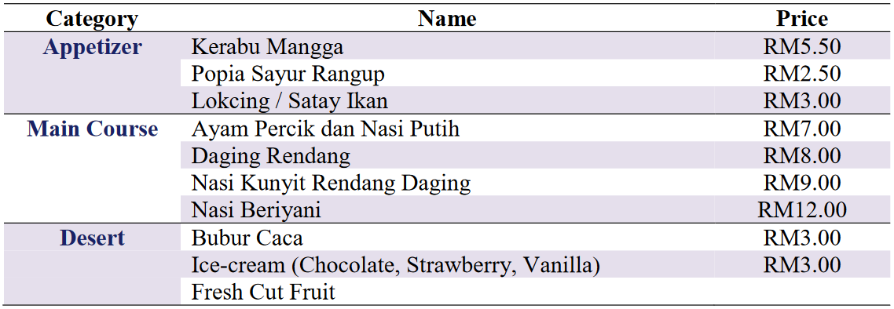

# PCPS-Project

This is my attempt at completing the coding part of the Programming Concept and Problem Solving project.
My assistance is needed to develop a food ordering system.

## Menu

## Requirements
- [x] User will input category
- [x] User will input type of food
- [x] User will input order quantity
- [x] Input validation
- [x] Print messages where deemed necessary
- [x] Neatly formatted design and arrangement
- [ ] Commented code
- [x] Generate receipt